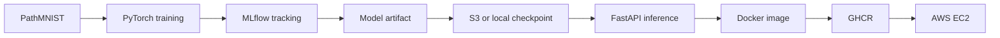
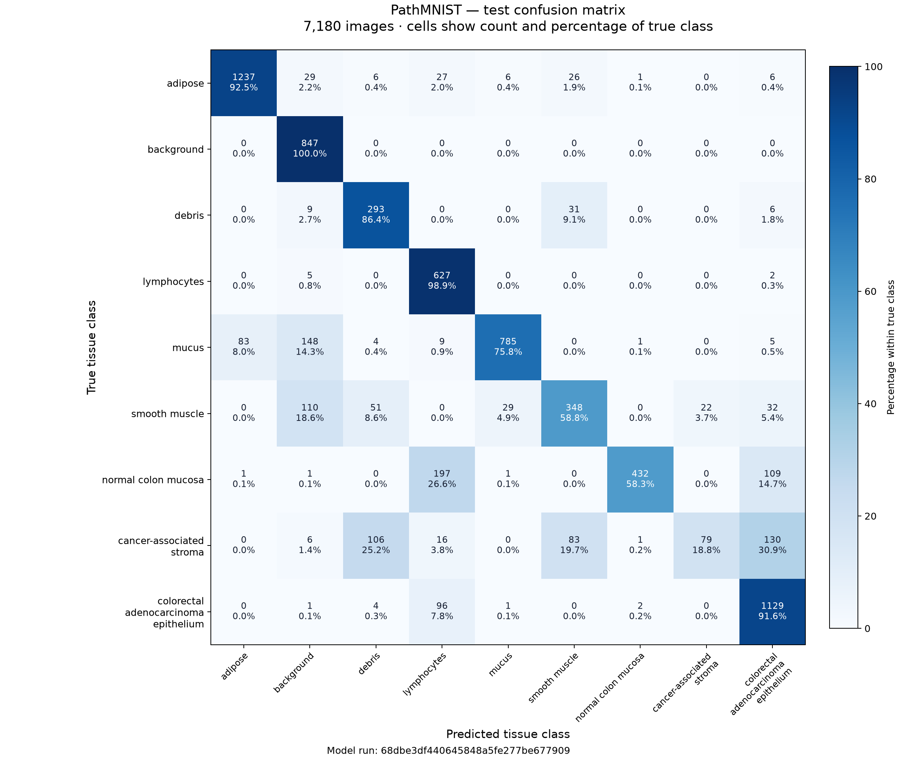

# Production MedVision API

An end-to-end ML engineering portfolio project that classifies nine tissue types
from PathMNIST histology patches. It connects reproducible PyTorch training and
MLflow experiment tracking to a checkpoint-backed FastAPI service, tested Docker
images, GHCR publishing, and a simple AWS EC2 deployment with optional S3 artifacts.

For research and portfolio demonstration only. Not intended for clinical diagnosis,
treatment decisions, or medical use.

**Tech stack:** Python 3.12 · PyTorch / torchvision · MedMNIST · MLflow · FastAPI /
Pydantic · pytest / Ruff · Docker · GitHub Actions / GHCR · AWS EC2 / S3 / IAM.



Training supports CPU, one GPU, and two-GPU DDP. The API exposes readiness, model
metadata, single-image inference and bounded batch inference; all predictions use
the loaded checkpoint. CI runs offline CPU tests and builds the image; pushes to
`main` or version tags publish to GHCR. Deployment uses one EC2 Docker container
with a local model mount or an S3 artifact accessed through an IAM role. See the
[EC2 deployment commands](docs/aws-deployment.md) and [model card](docs/model-card.md).

The measured baseline is summarized below. Trained weights remain outside Git;
synthetic test fixtures do **not** establish medical accuracy. AWS resources and
the first GHCR publication require your setup; no live deployment is claimed.

## Baseline results

ResNet-18 trained from scratch in a five-epoch PathMNIST run achieved **80.5% test
accuracy, 0.740 macro-F1, and 0.961 macro one-vs-rest AUROC** on **7,180 held-out
test samples**. This is the project's initial engineering baseline, not a
state-of-the-art claim. The exported model is selected by validation macro-F1.

| Metric | Test result |
| --- | ---: |
| Accuracy | 0.804596 |
| Macro-F1 | 0.740466 |
| Macro one-vs-rest AUROC | 0.960659 |
| Cross-entropy loss | 1.459959 |
| Test samples | 7,180 |

Results come from the author's Kaggle evaluation report for model run
`68dbe3df440645848a5fe277be677909`. The [complete report](reports/baseline/metrics.json)
includes the exact scores, training configuration, class order and confusion counts.
Accuracy and macro-F1 were cross-checked against those counts; AUROC and loss are
reported from the evaluation output and require prediction scores to recompute.

### Error analysis

Performance varied substantially across tissue classes, with strong recall for
background, lymphocytes, adipose, and colorectal adenocarcinoma epithelium, while
**cancer-associated stroma remained the most challenging class**.

| Tissue class | Correct / test samples | Recall |
| --- | ---: | ---: |
| adipose | 1,237 / 1,338 | 92.5% |
| background | 847 / 847 | 100.0% |
| debris | 293 / 339 | 86.4% |
| lymphocytes | 627 / 634 | 98.9% |
| mucus | 785 / 1,035 | 75.8% |
| smooth muscle | 348 / 592 | 58.8% |
| normal colon mucosa | 432 / 741 | 58.3% |
| cancer-associated stroma | 79 / 421 | 18.8% |
| colorectal adenocarcinoma epithelium | 1,129 / 1,233 | 91.6% |

Of the 421 stroma samples, only 79 were classified correctly. The largest confusions
were colorectal adenocarcinoma epithelium (**130**), debris (**106**), and smooth
muscle (**83**). High AUROC indicates useful class-score ranking across thresholds;
it does not imply uniformly reliable predictions across the nine tissue classes.



Rows are true classes and columns are predicted classes. Colors and percentages
are normalized within each true class, making low-recall classes visible despite
unequal class sizes. Counts are included in every cell.

### Preserve this baseline before further experiments

Keep this model and its test report as the reference for future comparisons. On
the Kaggle machine that still holds this run's `artifacts/model.pt`, run:

```bash
uv run --frozen python -m medvision.baseline
```

This archives the checkpoint, the published report, the confusion-matrix image and
a SHA-256 manifest under `artifacts/baselines/pathmnist-resnet18-v1/`. It checks the
checkpoint's model version and training configuration against the published report
and refuses to overwrite an existing baseline. If a newer training run has already
replaced `artifacts/model.pt`, supply the original checkpoint with `--checkpoint PATH`.
The expected run ID is `68dbe3df440645848a5fe277be677909`.

Download this baseline directory from Kaggle or copy it to persistent storage before
ending the session. A local archive in Kaggle's temporary storage is not a durable
backup. The original weights are not present in this repository, so the archive must
be created on the machine holding them. For inference, set
`MEDVISION_CHECKPOINT=artifacts/baselines/pathmnist-resnet18-v1/model.pt`.

Use a different `output_dir` and evaluation report path for subsequent experiments.
Do not overwrite the published baseline report or use repeated test-set feedback to
select model changes; compare candidates on validation data first. No model tuning
is included in this baseline publication.

To regenerate the published image without training or a GPU:

```bash
uv run --frozen python -m medvision.reporting \
  --report reports/baseline/metrics.json \
  --output assets/baseline-confusion-matrix.png
```

## Quick start

Requirements: Python 3.12, [uv](https://docs.astral.sh/uv/) (tested with 0.12.19),
and optionally Docker. Run all commands from the repository root.

### CPU setup

```bash
make setup-cpu
make check
make test
```

### GPU setup

On a CUDA-capable environment such as Kaggle, install the standard PyTorch dependencies:

```bash
make setup-gpu
```

Verify that PyTorch can see the GPU before starting a full training run:

```bash
uv run python -c "import torch; print(torch.cuda.is_available()); print(torch.cuda.get_device_name(0) if torch.cuda.is_available() else 'CPU')"
```

Training and evaluation automatically use CUDA when `torch.cuda.is_available()` is true
and otherwise fall back to CPU. Checkpoints are exported with CPU tensors, so artifacts
trained on a GPU remain loadable by the CPU inference service.

Training keeps deterministic algorithms enabled. Make exports
`CUBLAS_WORKSPACE_CONFIG=:4096:8` before launching Python, preserving an existing
override such as `:16:8`. Direct calls to `train()` set the default before CUDA
initialization, and training disables cuDNN benchmarking for repeatable runs.
If CUDA is already initialized in a notebook without this variable, restart the
kernel and set it before using CUDA. CPU and GPU results need not match bit for bit;
the checkpoint round-trip test compares metrics on the training device.

The offline test suite includes a tiny synthetic training round trip. For cloud-specific
setup, see [cloud development](docs/cloud-development.md).

### Kaggle GPU training

PNG report generation uses Matplotlib's non-interactive Agg renderer, even when
Kaggle exports an inline notebook backend unavailable in the project virtual
environment. No notebook plotting dependency is required. On an older checkout,
`!MPLBACKEND=Agg make check test` is a temporary workaround; pull the latest branch
for the report-generation fix.

Create a Kaggle Notebook, enable a GPU accelerator and Internet access, then run:

```bash
!git clone -b feat/medvision-baseline https://github.com/nak224/production-medvision-api.git
%cd production-medvision-api
%env CUBLAS_WORKSPACE_CONFIG=:4096:8
!pip install -q uv
!make setup-gpu
!uv run python -c "import torch; print('CUDA:', torch.cuda.is_available()); print(torch.cuda.get_device_name(0) if torch.cuda.is_available() else 'CPU')"
!make check test
!make download
!make smoke
```

The device check should print `CUDA: True` before running the full baseline. If the smoke
run succeeds, start the complete training and test-set evaluation with:

```bash
!make train
!make evaluate
```

Kaggle notebook storage is temporary. Download any checkpoint, report or MLflow artifact
you want to keep before the session ends, or copy it to persistent storage.

### Using both Kaggle T4 GPUs

Select **GPU T4 ×2** in Kaggle, then verify both devices are visible and run:

```python
!uv run --frozen python -c "import torch; print('GPUs:', torch.cuda.device_count())"
!make download
!make smoke-2gpu
!make train-2gpu
!make evaluate
```

The two-GPU targets require two visible CUDA devices. They launch one process per GPU
with `torchrun` and PyTorch DistributedDataParallel (NCCL). The ordinary `make train`
and `make smoke` commands still use a single GPU, or CPU when CUDA is unavailable.
Download the data once before launching workers.

`batch_size` is the **global batch size** and must divide evenly by the number of workers:
the default 128 means 64 images per GPU. Each worker trains on a different shuffled shard;
gradients are averaged across workers. For equal shard lengths without duplicate samples,
at most one training example is dropped per epoch with two workers. The official training
split is even, so the full two-GPU baseline drops none. The shuffle changes each epoch.

Worker 0 evaluates the complete validation split once, writes one MLflow run and exports
the usual CPU-loadable checkpoint. Other workers wait during validation. Batch normalization
uses local per-GPU batches; the exported running statistics belong to worker 0. Results can
differ from a single-GPU run even with the same seed and global batch size. MLflow records
worker count, batch size per worker, processed training sample count and global average loss.

Artifacts use the same paths as the single-GPU commands: `artifacts/smoke/model.pt` for
the smoke run and `artifacts/model.pt` for full training. Avoid running independent jobs
against the same output directory simultaneously. Evaluation and API inference continue
to use one device.

Two GPUs do not guarantee twice the speed: this small model on 28 × 28 images may spend
much of its time loading data and synchronizing gradients. Compare full-epoch timings
before increasing batch size. Each T4 keeps its own model copy; their memory is not pooled.
The distributed flow is tested with two CPU/Gloo workers; T4/NCCL execution and speedups
must be validated in Kaggle.

### Download and run a small real-data experiment

```bash
make download
make smoke
MEDVISION_CHECKPOINT=artifacts/smoke/model.pt make serve
```

`make download` fetches the official 28 × 28 PathMNIST archive from `zenodo.org`,
checks the published MD5 over the TLS-verified download, and reuses a valid local
archive. Dataset files remain in the ignored `data/` directory.

`make smoke` trains for one epoch on 256 training examples and evaluates 128 validation
examples. These deterministic subsets verify the workflow; they are **not** a full
benchmark. The checkpoint, SQLite tracking database and validation report are written
to `artifacts/smoke/`; the evaluation report is `reports/smoke-metrics.json`.

### Train and evaluate the baseline

```bash
make train
make evaluate
make serve
```

`configs/base.yaml` defines five epochs on the complete official training split. The
best validation macro-F1 selects `artifacts/model.pt`. The test split is only evaluated
by the separate evaluation command, which writes `reports/metrics.json`. Training uses
CUDA automatically when available; CPU training can take considerably longer. Relative
paths in configuration files are relative to the working directory.

Each training run records parameters, train loss, validation metrics and artifacts
in local MLflow. Re-running with the same output directory adds a tracking run and
replaces the exported checkpoint/report with the new run's best model; previous
run artifacts remain in MLflow. To inspect baseline runs:

```bash
uv run --frozen mlflow ui --backend-store-uri sqlite:///artifacts/mlflow.db --host 127.0.0.1
```

For the smoke experiment use `sqlite:///artifacts/smoke/mlflow.db` instead.

### API requests

| Endpoint | Response |
| --- | --- |
| `GET /health` | Readiness, whether a model is loaded, and its version; 503 when unready. |
| `GET /model-info` | Loaded checkpoint architecture, model version, dataset, class names and preprocessing; 503 without a model. |
| `POST /predict` | One PNG/JPEG upload in the `file` field; one prediction. |
| `POST /predict/batch` | PNG/JPEG uploads in repeated `files` fields; an ordered array of predictions with filenames. |

```bash
curl --fail http://127.0.0.1:8000/health
curl --fail http://127.0.0.1:8000/model-info
curl --fail -X POST -F 'file=@example.png' http://127.0.0.1:8000/predict
curl --fail -F 'files=@example.png' -F 'files=@another.jpg' \
  http://127.0.0.1:8000/predict/batch
```

Provide your own public research patch as `example.png`. The service accepts PNG
or JPEG (including grayscale converted to RGB), up to 5 MiB and 4 million pixels.
It resizes to 28 × 28 and returns `class_id`, `label`, `confidence`, all nine
`probabilities`, and `model_version`. Confidence is an uncalibrated softmax score.
OpenAPI is exposed at `/openapi.json`, with interactive documentation at `/docs`.

Batch predictions reuse the single-image decoder and Predictor. Limits are **16
files, 5 MiB per file, 20 MiB total**, and 4 million pixels per image. Each result
contains `filename` plus the same prediction fields as `/predict`. A batch is
all-or-nothing: a bad image returns 413/415/422 with a zero-based `index`,
`filename` and `error` in `detail`, with no partial results. Count/total-size limits
return 413; missing uploads return 422; a missing model returns 503. All uploads
are closed on success and failure. FastAPI spools multipart uploads before these
endpoint limits are checked; run this unauthenticated demo behind restricted
network access, as described in the deployment guide.

`/model-info` reports checkpoint values without duplicating model constants or
exposing weights/training configuration. The current checkpoint stores a versioned
preprocessing identifier (`rgb-resize28-bilinear-normalize0.5-v1`), not separate
input dimensions/format. Optional `input_size` and `expected_input_format` fields
are returned only if represented in checkpoint metadata.

`/health` returns 200 when a model is loaded, or 503 with `model_not_ready` when
the checkpoint is missing. Invalid uploads return 422, unsupported image formats
415, and images exceeding the limits 413. A corrupt or incompatible checkpoint
fails startup. Set `MEDVISION_CHECKPOINT` before starting the service; restart it
after replacing weights. There is no hot reload of model artifacts.

Optionally set `MEDVISION_MODEL_S3_URI=s3://your-bucket/models/model.pt` at startup.
It takes precedence over `MEDVISION_CHECKPOINT`, downloads a temporary artifact,
and loads it through the same checkpoint validation. Boto3 uses standard AWS
credentials or an EC2 IAM role. Invalid URIs/download failures fail startup; unset
the S3 variable to return to local loading. The temporary file is removed after
loading (also on failure). See [.env.example](.env.example) and the
[AWS guide](docs/aws-deployment.md) for configuration; no credentials belong in Git.

### Docker

Train a checkpoint first, then build and mount the artifact read-only:

```bash
docker build -t medvision-api .
chmod a+rx artifacts
chmod a+r artifacts/model.pt
docker run --rm -p 8000:8000 \
  --mount type=bind,src="$(pwd)/artifacts",dst=/models,readonly \
  medvision-api
```

For a smoke checkpoint, apply the permission commands to `artifacts/smoke` and
its `model.pt`, then mount `$(pwd)/artifacts/smoke` instead. These permissions let
the container's non-root user read the exported model. The container expects
`/models/model.pt`. Data and weights are excluded from the image. A missing
checkpoint leaves the container unhealthy (503).

After CI publishes on `main`, pull the same image from GHCR with
`docker pull ghcr.io/nak224/production-medvision-api:latest`. Published builds also
have `sha-<full-commit-sha>` tags; a version tag such as `v1.0.0` publishes `1.0.0`.
PR checks are read-only and never publish. Follow the [EC2 guide](docs/aws-deployment.md)
for Docker installation, private GHCR login, local/S3 checkpoint setup, restricted
ports and health verification. No AWS deployment runs automatically.

## Data and architecture

- Dataset: [PathMNIST / MedMNIST v2](https://zenodo.org/records/10519652),
  28 × 28 RGB histology patches, nine tissue classes.
- Official splits: 89,996 training, 10,004 validation, 7,180 test images; the test
  data comes from a different clinical center.
- Dataset license: **CC BY 4.0**, as declared by MedMNIST 3.0.2. Original data
  and model licenses are separate from any future code license for this repository.
- Model: torchvision ResNet-18 trained from scratch; a 3 × 3 stride-1 stem and
  no initial max-pooling preserve detail in small images. No pretrained weights
  are downloaded.
- Preprocessing: RGB, bilinear resize, channel normalization with mean/std 0.5,
  shared between training, evaluation and inference.
- Metrics: accuracy, macro-F1 across all nine classes, macro one-vs-rest AUROC,
  cross-entropy loss, and a confusion matrix. AUROC is `null` when a subset lacks
  one or more classes.
- Reproducibility: locked/versioned dependencies, a versioned configuration, fixed
  seeds and untouched official splits. Results can differ across CPU/GPU hardware
  and library/runtime environments.

## Layout

```text
src/medvision/   data, configuration, model, training, evaluation, inference
api/             FastAPI application and response schemas
configs/         full baseline and small smoke-run settings
tests/           offline data, training, export, inference and API tests
docs/            model card, cloud development and AWS deployment guide
.github/         CI: lint, formatting, CPU tests, Docker build and GHCR publishing
```

Working reports, datasets, weights and MLflow databases are ignored by Git. The
reviewed baseline report under `reports/baseline/` and its figure are versioned.
GitHub Actions will run after these files are pushed; a local test pass is not a
hosted CI result. A public demo, calibration, latency
measurements, a release and a code-license decision remain future work.
