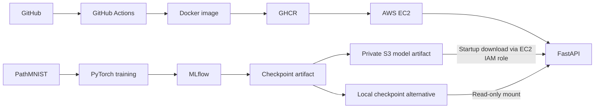

# Production MedVision API

An end-to-end ML engineering portfolio project for nine-class PathMNIST tissue
classification: reproducible PyTorch training, MLflow experiment tracking, and a
FastAPI inference service deployed with Docker, GHCR, and AWS EC2.

**For research and portfolio demonstration only. Not intended for clinical
diagnosis, treatment decisions, or medical use.**

**Tech stack:** Python 3.12 · PyTorch / torchvision · MedMNIST · MLflow · FastAPI /
Pydantic · pytest / Ruff · Docker · GitHub Actions / GHCR · AWS EC2 / S3 / IAM.

## Demo

The application is deployed as a Docker container on AWS EC2. The trained checkpoint
is stored in private Amazon S3 storage and loaded at startup through an EC2 IAM role.
Access is restricted through the [documented SSH tunnel](docs/aws-deployment.md#5-verify-and-access-the-api);
no public unauthenticated live endpoint is exposed.


*Recording placeholder: add `assets/medvision-demo.gif` showing the deployed service
accessed through the documented secure setup.*

## Highlights

- End-to-end PyTorch training and evaluation with MLflow tracking.
- CPU, single-GPU, and two-GPU DistributedDataParallel (DDP) training.
- FastAPI model metadata, readiness checks, and single/batch image inference.
- Automated offline tests, Docker packaging, and GitHub Actions CI/CD.
- Working GHCR image publishing and AWS EC2 deployment.
- Private S3 model artifacts loaded through an EC2 IAM role.

## Architecture



## Baseline Results

ResNet-18 trained from scratch in a five-epoch PathMNIST run achieved **80.5% test
accuracy, 0.740 macro-F1, and 0.961 macro one-vs-rest AUROC** on **7,180 held-out
test samples**. This is the initial engineering baseline, not a state-of-the-art
claim. The exported model is selected by validation macro-F1.

| Metric | Test result |
| --- | ---: |
| Accuracy | 0.804596 |
| Macro-F1 | 0.740466 |
| Macro one-vs-rest AUROC | 0.960659 |
| Cross-entropy loss | 1.459959 |
| Test samples | 7,180 |

Model version: **`8ffb86dbbb4b47ecb42784b50521a47e`**. The author's
[complete evaluation report](reports/baseline/metrics.json) records the configuration,
class order and confusion counts. Accuracy and macro-F1 were cross-checked against
those counts; AUROC and loss are reported from evaluation and require prediction
scores to recompute. See the [report provenance](reports/baseline/README.md).


Rows are true classes; columns are predictions. Colors and percentages are normalized
within each true class, with counts shown in every cell.

### Error analysis

| Tissue class | Correct / test samples | Recall |
| --- | ---: | ---: |
| adipose | 1,237 / 1,338 | 92.5% |
| background | 847 / 847 | 100.0% |
| debris | 293 / 339 | 86.4% |
| lymphocytes | 627 / 634 | 98.9% |
| mucus | 785 / 1,035 | 75.8% |
| smooth muscle | 348 / 592 | 58.8% |
| normal colon mucosa | 432 / 741 | 58.3% |
| cancer-associated stroma | 79 / 421 | 18.8% |
| colorectal adenocarcinoma epithelium | 1,129 / 1,233 | 91.6% |

**Cancer-associated stroma is the weakest class:** 79/421 correct, with the largest
confusions involving colorectal adenocarcinoma epithelium (130), debris (106), and
smooth muscle (83). Background, lymphocytes, adipose, and adenocarcinoma have strong
recall. High AUROC reflects score ranking, not uniformly reliable classification
across all nine tissue classes.

Preserve the published checkpoint/report before further experiments with
`uv run --frozen python -m medvision.baseline`. Weights are intentionally excluded
from Git; keep the archive in persistent storage. See the
[baseline preservation instructions](reports/baseline/README.md).

## Quick Start

Requirements: Python 3.12, [uv](https://docs.astral.sh/uv/) (tested with 0.12.19),
and optionally Docker. Run commands from the repository root.

### CPU setup

```bash
make setup-cpu
make check test
```

### GPU setup

Install standard PyTorch dependencies on a CUDA-capable machine and check availability:

```bash
make setup-gpu
uv run python -c "import torch; print('CUDA:', torch.cuda.is_available()); print('GPUs:', torch.cuda.device_count())"
```

Training and evaluation automatically select CUDA when available, otherwise CPU.
Exported checkpoints contain CPU tensors and remain loadable by the CPU inference
service. For two GPUs, use the DDP commands in [Training](#training).

### Docker

With a trained checkpoint at `artifacts/model.pt`, build and mount it read-only:

```bash
docker build -t medvision-api .
chmod a+rx artifacts
chmod a+r artifacts/model.pt
docker run --rm -p 127.0.0.1:8000:8000 \
  --mount type=bind,src="$(pwd)/artifacts",dst=/models,readonly \
  medvision-api
```

The non-root container expects `/models/model.pt`; data and weights are excluded
from the image. A missing checkpoint leaves it unhealthy (HTTP 503). For a smoke
checkpoint, use `artifacts/smoke` in the permission and mount commands. A published
image is also available:

```bash
docker pull ghcr.io/nak224/production-medvision-api:latest
```

## Training

Download PathMNIST, verify the pipeline with a smoke run, then train and evaluate:

```bash
make download
make smoke
make train
make evaluate
make serve
```

The downloader retrieves the official 28 × 28 archive from `zenodo.org`, verifies
its published MD5 over TLS, and reuses a valid local copy. Data stays in `data/`.
The smoke run uses one epoch, 256 training and 128 validation examples; it verifies
the workflow and is not a benchmark. Serve its checkpoint with
`MEDVISION_CHECKPOINT=artifacts/smoke/model.pt make serve`.

`configs/base.yaml` specifies five full training epochs. Validation macro-F1 selects
`artifacts/model.pt`; the separate evaluation command writes test results to
`reports/metrics.json`. Paths are relative to the working directory. MLflow records
parameters, losses, validation metrics and artifacts:

```bash
uv run --frozen mlflow ui --backend-store-uri sqlite:///artifacts/mlflow.db --host 127.0.0.1
```

### Two-GPU DDP

After GPU setup, use two visible CUDA devices. The default global batch size of 128
is split into 64 images per GPU; a custom batch size must divide evenly by two.

```bash
make check-2gpu
make download
make smoke-2gpu
make train-2gpu
make evaluate
```

These targets launch one worker per GPU with `torchrun` and NCCL. Standard training
uses one GPU or CPU; evaluation and inference use one device. See
[cloud development](docs/cloud-development.md#two-gpu-ddp-details) for worker behavior,
artifact paths and hardware validation notes.

### Kaggle example

Enable a GPU accelerator and Internet access in a Kaggle Notebook:

```python
!git clone -b main https://github.com/nak224/production-medvision-api.git
%cd production-medvision-api
%env CUBLAS_WORKSPACE_CONFIG=:4096:8
!pip install -q uv
!make setup-gpu
!uv run python -c "import torch; print('CUDA:', torch.cuda.is_available()); print('GPUs:', torch.cuda.device_count())"
!make check test
!make download smoke
!make train evaluate
```

Confirm CUDA is available before full training. For two GPUs, select a two-GPU
accelerator and use `!make smoke-2gpu` / `!make train-2gpu` instead. Save artifacts
to persistent storage before ending the session; see the
[notebook setup notes](docs/cloud-development.md#cuda-and-notebook-setup).

## API

| Endpoint | Response |
| --- | --- |
| `GET /health` | Readiness, model-loaded status and model version. |
| `GET /model-info` | Checkpoint architecture, version, dataset, class names and preprocessing. |
| `POST /predict` | One PNG/JPEG upload in the `file` field; one prediction. |
| `POST /predict/batch` | Repeated `files` uploads; ordered predictions with filenames. |

```bash
curl --fail http://127.0.0.1:8000/health
curl --fail http://127.0.0.1:8000/model-info
curl --fail -F 'file=@example.png' http://127.0.0.1:8000/predict
curl --fail -F 'files=@example.png' -F 'files=@another.jpg' \
  http://127.0.0.1:8000/predict/batch
```

Use your own public research patches. PNG/JPEG uploads, including grayscale converted
to RGB, are resized to 28 × 28. Predictions contain `class_id`, `label`, `confidence`,
all nine `probabilities`, and `model_version`; batches also include `filename`.
Confidence is an uncalibrated softmax score.

Limits: **5 MiB and 4 million pixels per image; 16 files and 20 MiB total per batch**.
Batches are all-or-nothing. Invalid uploads return 422, unsupported formats 415,
limit violations 413, and an unloaded model 503. OpenAPI is at `/openapi.json`, with
interactive docs at `/docs`. See [API behavior](docs/aws-deployment.md#api-behavior)
for error details, metadata fields and upload handling.

## Deployment

GHCR publishing is configured and working, and the API has been deployed on AWS EC2
with a private S3 checkpoint loaded through an IAM role. Access remains restricted;
there is no public unauthenticated live endpoint.

GitHub Actions runs lint, formatting, offline CPU tests and a Docker build before
publishing on `main` or version-tag pushes. Tags include `latest` for main,
`sha-<full-commit-sha>`, and `1.0.0` for `v1.0.0`; PR checks are read-only and never
publish. EC2 rollout remains manual.

Local loading uses `MEDVISION_CHECKPOINT` (`artifacts/model.pt` outside Docker).
Setting `MEDVISION_MODEL_S3_URI=s3://your-bucket/models/model.pt` selects S3 instead.
Boto3 uses the standard AWS credential chain; credentials are never hardcoded.
Missing local weights return 503; invalid S3 configuration, download failures or
corrupt/incompatible checkpoints fail startup. Restart after replacing weights.

The [AWS deployment guide](docs/aws-deployment.md) covers Docker installation, private
GHCR authentication, IAM/S3 configuration, restricted ports, the SSH tunnel and
health verification. Environment examples are in [.env.example](.env.example).

## Dataset and Model

- **Data:** [PathMNIST / MedMNIST v2](https://zenodo.org/records/10519652), 28 × 28 RGB
  histology patches across nine tissue classes. Official splits: 89,996 training,
  10,004 validation and 7,180 test images; test data comes from a different clinical center.
- **License:** dataset **CC BY 4.0**, as declared by MedMNIST 3.0.2. Data/model licenses
  are separate from any future code license for this repository.
- **Model:** torchvision ResNet-18 trained from scratch, with a 3 × 3 stride-1 stem
  and no initial max-pooling. No pretrained weights are downloaded.
- **Preprocessing:** RGB conversion, bilinear resize and channel normalization with
  mean/std 0.5, shared across training, evaluation and inference.

## Reproducibility and Limitations

Locked/versioned dependencies, versioned configuration, fixed seeds, deterministic
training settings and untouched official splits support reproducibility. Results
can differ across CPU/GPU hardware and library environments. See
[CUDA setup details](docs/cloud-development.md#cuda-and-notebook-setup).

The offline tests include synthetic training/checkpoint round trips; they do **not**
establish medical accuracy. Metrics include accuracy, macro-F1 across all nine
classes, macro one-vs-rest AUROC, cross-entropy loss and a confusion matrix. AUROC
is `null` when a subset lacks one or more classes. Select changes on validation data
rather than repeated test-set feedback.

Low-resolution research patches and arbitrary uploads do not establish clinical
suitability. Confidence is uncalibrated; clinical validation and out-of-distribution
detection are outside this demonstration. See the [model card](docs/model-card.md)
for intended use and limitations. No clinical or treatment decisions should rely
on this service.

## Project Layout

```text
src/medvision/   data, configuration, model, training, evaluation, inference
api/             FastAPI application and response schemas
configs/         full baseline and smoke-run settings
tests/           offline data, training, export, inference and API tests
docs/            model card, cloud development and AWS deployment guide
.github/         CI: lint, formatting, CPU tests, Docker build and GHCR publishing
```

Working reports, datasets, weights and MLflow databases are ignored by Git. The
reviewed report in `reports/baseline/` and its confusion-matrix figure are versioned.
